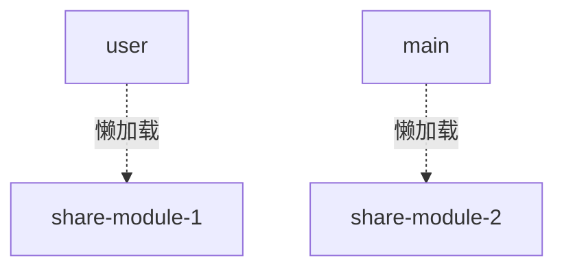
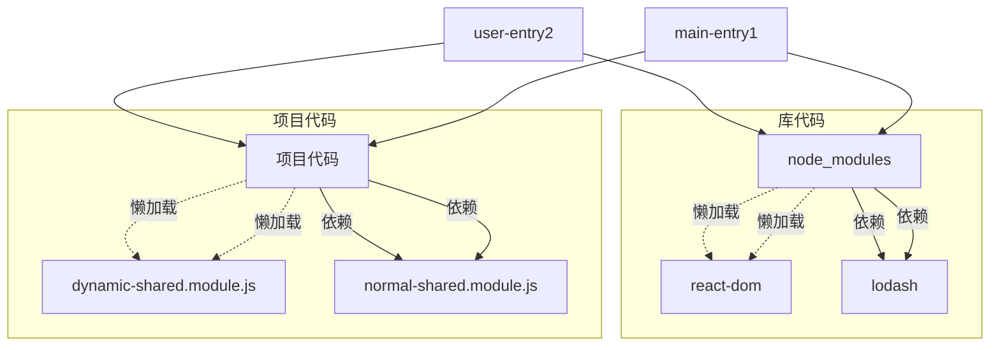

# 进阶：玉虚末期


## 1. 异步引入

> 异步引入是异步引入，代码分割是代码分割

#### 1. Dynamic import 模块不需要再在 SplitChunk 中申明

主要管理异步引入的

> dynamic import 会自动被单独打包为一个 chunk，不必担心代码 couple



* `webpack.config.js`

  ```js
  const webpack = require('webpack');
  
  module.exports = {
    entry: {
      main: __dirname + '/app/main.js',
      user: __dirname + '/app/user-module/user.module.js'
    },
    output: {
      path: __dirname + '/build', 
      filename: '[name].bundle-[hash].js',
      chunkFilename: '[name].bundle~[hash].js' // 一切非entry 的chunk命名规则
    },
    resolve: {
      alias: {
        sharedModule: __dirname + '/app/shared-module/shared.module.js',
        sharedModule2: __dirname + '/app/shared-module/shared2.module.js'
      }
    },
    optimization: {
      //  nothing to configure here!
    },
  }
  ```

  * 靠 `chunkFilename` + `magic comment `单独将模块打包为 chunk
  * **不需要在  optimization 中去配置 splitChunk**
  * 注意利用 alias 的功能

* 项目代码

  * `main.js`

    ```js
    import (
        /* webpackChunkName: "share" */
        'sharedModule'
      ).then(variable => {
        console.log(variable);
      }).catch(error => {console.log(error)});
    ```

  * `user.js`

    ```js
      import (
        /* webpackChunkName: "share2" */
        'sharedModule2'
      ).then(() => {
        console.log('user');
      }).catch(error => {
        console.log(error)
      });
    
    ```

  * **注意**！⚠️：  在 magic comment 中，两个chunk 的注入名字不能重复，否则会被打包进一个chunk 中


####2. dynamic import 异步加载模块内部 中可能出现 couple 代码

> 这个需求就非常符合项目了，项目可能加载多个独立的懒模块(route-lazy-load)，而懒模块中可能有很多复用代码。

* 下图结构

  ```mermaid
  graph TD
      B[user]
      C[main]
      B-.->|懒加载|D[share-module-1]
      C-.->|懒加载|E[share-module-2]
      D-->|import|F[variable.js]
      E-->|import|F[variable.js]
  ```

  * `variable.js` 的内容会在两次被懒加载的模块内部，被引入两次
    * 因为 variable.js 是靠正常 import 导入的

* 优化方案
  * ⚠️思想：将**异步加载**的 **项目代码**都打包成一个 chunk
  * 下一个章节，会讲


## 2. 代码分割优化

**webpack4 splitChunk optimization**


####0. 项目结构



#### 1. 优化思想

* 库 `node_modules` , 靠 `splitChunks` 来实现
  * syncVendors + `htmlWebpackPlugin` 引入
  * asyncVendors
* 项目代码
  * entry chunks
    * `HtmlWebpackPlugin` 引入，注意有顺序区别
  * 首次加载就需要的，被**共用的** 项目代码
    * 靠 `splitChunks` 来优化 + `htmlWebpackPlugin` 引入
  * 异步懒加载的代码
    * dynamic import + magic comment,  不需要再在 `splitChunks` 中配置了
  * 异步懒加载代码的公用代码
    * 靠 `splitChunks` 来优化

 

#### 2.  node_modules 分割成  asyncVendors-chunk 和 vendors-chunk

* `webpack.config.js`

  ```js
  module.exports = {
    ....
    plugins: [
      new HtmlWebpackPlugin({
        template: __dirname + "/app/index.tmpl.html",
        chunks: ['main', 'user', 'vendors'],
      }),
    optimization: {
      splitChunks: {
        cacheGroups: {
           syncVendors: {
             test: /[\\/]node_modules[\\/]/,
             name: 'vendors',
             chunks: 'initial',
           },
           asyncVendors: {
  		  test: /[\\/]node_modules[\\/]/,
             name: 'asyncVendors',
             chunks: 'async',
           }
        }
      }
    },
  }
  ```

  * 注意 `vendors` 写入 `HtmlWebpackPlugin` ，首次加载必须条件

  * ⚠️ `cacheGroups.chunks`  非省略项！（省略了此项，common chunk 不会起作用）

    * 'all': 该chunk 可同时被同步，异步被引用
    * 'async': 该项是异步被引用
    * 'initial': 该项是同步被引用

    > Webpack 在编译工程代码的时候，提前就知道哪些地方调用了 dynamic import，这样就可以准确的生成合适的 chunk


#### 3. 将公用的  -项目代码- 打包成  common-chunk 和 async-common-chunk

* `webpack.config.js`

  ```js
  optimization: {
      splitChunks: {
        cacheGroups: {
          // 之前对库代码的处理
          .....
          common: {
            chunks: 'initial',
            test: /app/,
            name: 'common',
            minSize: 0,
            minChunks: 2
          },
          asyncCommon: {
            chunks: 'async',
            test: /app/,
            name: 'asyncCommon',
            minSize: 0
          }
        }
      }
    },
  ```

  * minChunks: 至少被引用几次
  * minSize: 0, 项目代码的大小至少为0kb


----

### 关于 split-chunk-plugin 的额外信息

#### *4. 依赖可能同时属于多个 已经被splitted 的 chunks, 靠 priority 区分

**注意！ 这里配置的主体们是已经被 split 的 common chunk**

* 项目结构

  ```mermaid
  graph TD
      
      F[share-module-1]
      E[share-module-2]
      F-->|import|G[variable.js]
      E-->|import|G
  ```

  * `shared-module-1` 和 `shared-module-2` 都是已经被splitChunks 优化的 chunks

* `webpack.config.js`

  ```js
  optimization
  ...
  	  shared1: {
            test: /[\\/]shared-module-1[\\/]/,
            name: 'shared',
            chunks: 'all',
            minChunks: 1,
            minSize: 0,
            priority: 2
          },
          shared2: {
            test: /[\\/]shared-module-2[\\/]/,
            name: 'variable',
            chunks: 'all',
            minChunks: 1,
            minSize: 0,
            priority: 1
          },
  ```

  * 注意配置 `cacheGroups.chunks`
  * `variable.js` 依赖可以属于两个 common chunk，通过**priority**，将`variable.js` 判定给shared-module-1


####*5. minimal optimization: 分割出只跟某个entry chunk有关的 vendors, 打包进一个chunk 

> 待考究，并不是很推荐

* 项目结构

  ```mermaid
  graph TD
      B[user]
      C[main]
      B-->D[node_modules/react]
      C-->E[node_modules/other-module]
      D-->F[node_modules/ 一些共同依赖]
      E-->F
  ```

  * 分割出所有跟 `entry: main` 有关的依赖

* `webpack.config.js`

  ```js
  new HtmlWebpackPlugin({
        template: __dirname + "/app/index.tmpl.html",
        chunks: ['main', 'user', 'vendors'],
      }),
  .....
  optimization: {
      splitChunks: {
        cacheGroups: {
          vendors: {
            name: 'vendors',
            chunks: 'all',
            enforce: true,
            priority: 1,
            test(module, chunks) {
              const name = module.nameForCondition && module.nameForCondition();
              return chunks.some(chunk => chunk.name === 'main' && /node_modules/.test(name));
            }
          },
  ```

  * 所有和 `main` 有关的在 `node_modules` 的依赖都被打包进 vendors

* 陷阱

  如果这里画蛇添足，再为`node_modules` 中的依赖，使用splitChunks，生成一个 common chunk

  * `webpack.config.js`

    ```js
    /[\\/]shared-module-2[\\/]/,new HtmlWebpackPlugin({
          template: __dirname + "/app/index.tmpl.html",
          chunks: ['main', 'user', 'vendors'],
        }),
    .....
    optimization: {
        splitChunks: {
          cacheGroups: {
            vendors: {
              name: 'vendors',
              chunks: 'all',
              enforce: true,
              priority: 1,
              test(module, chunks) {
                const name = module.nameForCondition && module.nameForCondition();
                return chunks.some(chunk => chunk.name === 'main' && /node_modules/.test(name));
              }
             otherVendors: {
    			name: 'otherVendors',
                 chunks: 'all',
                 priority: 0,
                 test: /[\\/]node_modules[\\/]/,
              }
            },
    ```

    * 乍一看，好像还挺正确，但是最后网页其实是无法正确运行的
    * 因为 webpack bootstrap 程序会先检查有需要的 `deferred Module` ，而 otherVendors 作为其中之一，没有被引入(`HtmlWebpackPlugin` 引入)，因此 `main` 的代码执行会被跳过
      * webpack  先检查 `entry: main.js` 发现其中引入了 node_modules 的某个依赖
      * 靠 `vendors.chunk` 正确找到了依赖
      * webpack bootstrap 发现 `otherVendors.chunk` 也是关于 node_modules 依赖的一个 chunk, 根据第一点所知，第一次加载需要node_modules 的依赖，而`otherVendors.chunk`极有可能包含 加载所需同步引入的依赖 ，因为`cacheGroups.chunks: 'all'`
      * `otherVendors.chunk` 没有被 `HtmlWebpackPlugin` 引入
      * webpack bootstrap 程序会跳过 `main`，直到`otherVendors.chunk`被引入
    * 可以自行打断点 debug
      * [参考](https://stackoverflow.com/questions/50129112/webpack4-does-not-execute-main-module-to-my-page-entry)
    * 这时要么不要这个 otherVendor, 要么将它的 `cacheGroups.chunks` 改为 `async`，那么它就不属于是 `deferred module`了


## 3. Webpack3 的代码分割优化

> 从Deloitte Angular 项目中摘取


请参考 [掘金-CommonChunk](https://juejin.im/post/5a706f34f265da3e5b33185a)


* 首次加载需要的，/node_modules/ 代码

  ```js
  new CommonsChunkPlugin({
      "name": [
          "vendor"
      ],
      "minChunks": (module) => {
          return module.resource
          && (module.resource.startsWith(nodeModules)
              || module.resource.startsWith(genDirNodeModules)
              || module.resource.startsWith(realNodeModules));
      },
      "chunks": [
          "main"
      ]
  }),
  ```

  * `chunks: [main]`  从传入的 entry-chunk: main中提取
    * 该项目中， main是入口代码

* 异步加载的，公用的，项目代码

  ```js
  new CommonsChunkPlugin({
      "minChunks": ({
          resource
      }, count) => (/src/).test(resource)
      &&!(/src\/app\/scenario\-stats/).test(resource)
      && !(/src\/app\/library/).test(resource)
      && !(/src\/app\/news/).test(resource) && count >=2,
      "async": "common"
  }),
  ```

  * `count>=2`  被使用两次以上的
  * 在 src 文件夹下的
    * 排除了 `scenario-stats`, `library`, `news`  。它们都是懒加载的代码，因为需求被使用了两次以上，因此这里要排除它们（它们自动生成一个 chunk），不把它们打包进 `common` 
  * `async: common` 异步加载的（取名为 common）

* 异步加载的，node_modules 代码

  ```js
  new CommonsChunkPlugin({
      "minChunks": (
          module, count
      ) => module.resource && (/node_modules/).test(module.resource) && count >= 2,
      "async": 'asyncVendor'
  }),
  ```

  


## 4. 利用Webpack 实现浏览器缓存

> 众所周知，优化一个页面的方法之一就是利用浏览器的缓存机制，在文件名不改变的情况下，使客户端不用频繁向服务端请求和重复下载相同的资源，节约了流量的开销。


#### 1. 之前的配置

* `webpack.config.js`

  ```js
  ...
  module.exports = {
    entry: {
      main: __dirname + '/app/main.js',
      user: __dirname + '/app/user-module/user.module.js'
    },
    output: {
      path: __dirname + '/build', //打包后的文件存放的地方
      filename: '[name].bundle-[hash].js',
      chunkFilename: '[name].bundle-[hash].js'
    },
    ...
    module: {
      rules: [{
        test: /(\.(s?)css|\.sass)$/,
        use: [{
            loader: MiniCssExtractPlugin.loader,
            options: {
              // you can specify a publicPath here
              // by default it use publicPath in webpackOptions.output
              // publicPath: '../'
            }
          },
          'css-loader',
          'sass-loader'
        ],
        exclude: /node_modules/
      }...]
    },
    ...
    plugins: [
      ...
      new MiniCssExtractPlugin({
        // Options similar to the same options in webpackOptions.output
        // both options are optional
        filename: "[name]-[hash].css",
        chunkFilename: "[id].css"
      }),
      ....
  }
  ```

* 效果

  * 每次编译都会把文件打包成独立的带有唯一hash值的 文件
  * 每一次重新编译，**所有文件的 hash值都改变了**！浏览器必须重新请求文件


#### 2. 长缓存的 hash 配置


* output 中 使用 `chunkhash` 代替 `hash` , 实现js 文件的长缓存

  ```js
  module.exports = {
    entry: {
      main: __dirname + '/app/main.js',
      user: __dirname + '/app/user-module/user.module.js'
    },
    output: {
      path: __dirname + '/build', //打包后的文件存放的地方
      filename: '[name].bundle-[chunkhash].js',
      chunkFilename: '[name].bundle-[chunkhash].js'
    },
  ```

  * 每次文件变动，只有被更改的文件被赋值新的 hash，其他文件不变。这对一些库文件来说（不经常变动），是非常友好的

    > 需要注意一点的是 webpack4 之前chunkhash 与 commonChunkPlugin 需要额外hack 一下才能正常运行

    参考:  [webpack 长缓存1](https://www.cnblogs.com/wonyun/p/8146139.html)， [webpack 长缓存2](https://juejin.im/entry/59b0dde46fb9a024844959a1)

* css plugin 的缓存，使用`contenthash` 代替 `hash`

  ```js
  plugins: [
      ...
      new MiniCssExtractPlugin({
        // Options similar to the same options in webpackOptions.output
        // both options are optional
        filename: "[name]-[contenthash].css",
        chunkFilename: "[id].css"
      }),
  ```

* image / 文件的 长缓存

  ...

  

